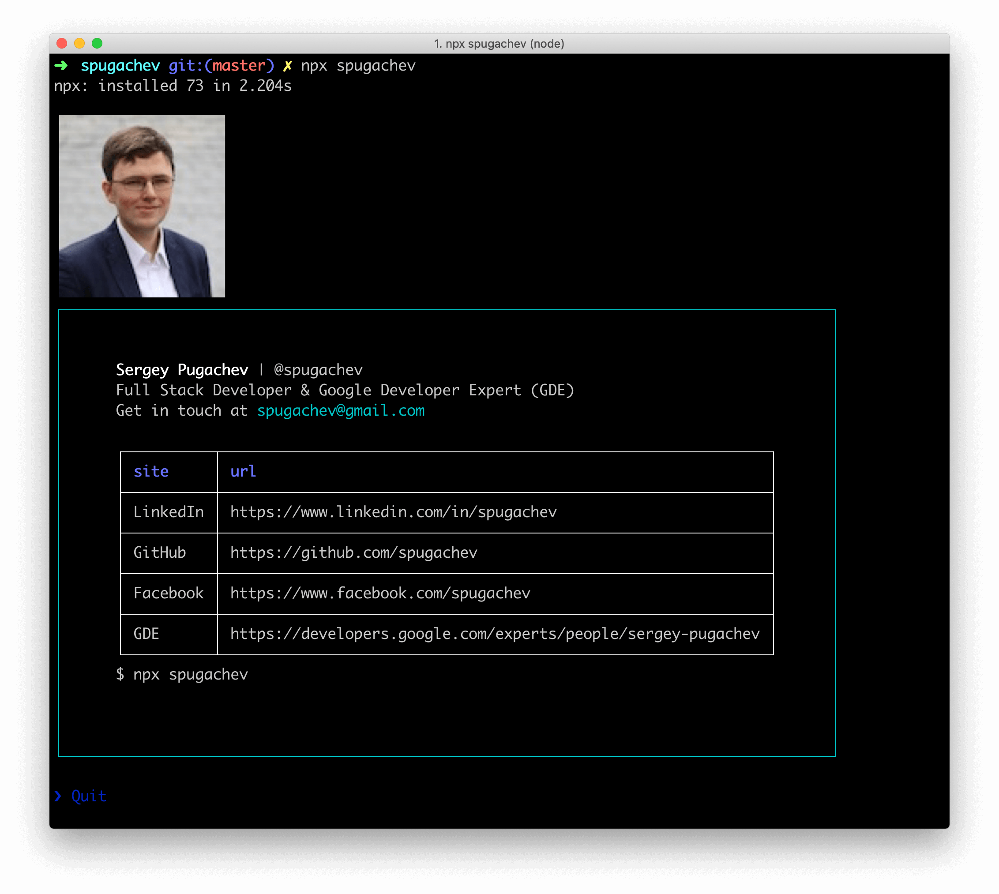

> The Sergey Pugachev CLI



## Usage

Install Node.js, then:

```
$ npx spugachev
```


## Built with

- [ink](https://github.com/vadimdemedes/ink) - React for interactive command-line apps


## License

MIT © Sergey Pugachev